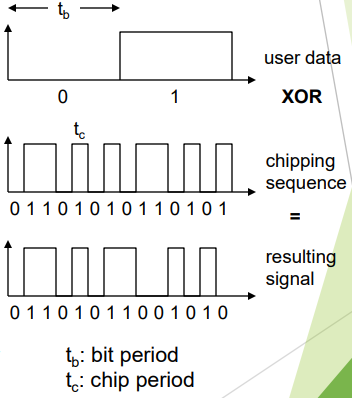
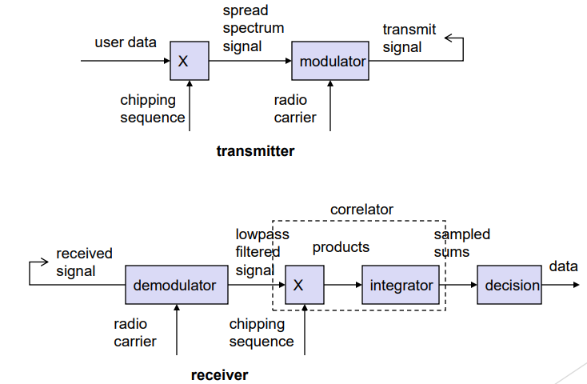
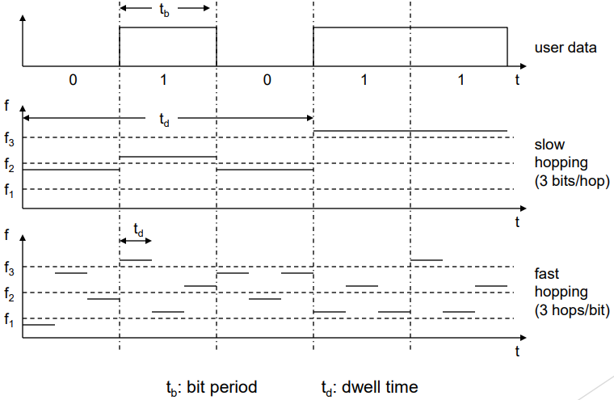

`Page 71 - 80`

# Spread Spectrum

- Spread spectrum is a technique that involves spreading the bandwidth needed to transmit data.
- The spread signal has the same energy as the original signal but is spread over a larger frequency range.
- This provides resistance to narrowband interference.
  - Spread spectrum communication offers improved resistance to interference because an interfering signal will no longer corrupt the desired signal after the communicating devices have switched to a new carrier frequency,
  - The core principle of spread spectrum is the use of noise-like carrier waves and bandwidths much wider than that required for simple point-to-point communication at the same data rate. This makes a system resistant to jamming and interference.

## Expanded information

- Spread spectrum is a technique used for transmitting radio or telecommunications signals. The term refers to the practice of spreading the transmitted signal to occupy the frequency spectrum available for transmission. The advantages of spectrum spreading include noise reduction, security and resistance to jamming and interception.

- In spread spectrum communication, a special code (pseudo noise) is used for spectrum spreading and the same code is used to despread the signal at the receiver. This allows for more secure communication as well as reducing interference.

## Direct Sequence Spread Spectrum

DSSS is a method of transmitting radio signals by spreading the signal over a wide frequency band.

- This is done by performing an XOR operation between the user bit sequence and a chipping sequence.
- The chipping sequence has smaller pulses than the user bit duration and if generated properly, it may appear as random noise.
- This is sometimes called pseudo-noise (PN).
- The ratio of the user bit duration to the chipping sequence pulse duration is known as the spreading factor and determines the bandwidth of the resultant signal.

DSSS is used by 802.11b wireless networks.

## More DSSS

Direct Sequence Spread Spectrum (DSSS) is a technique where the signal is XORed with a pseudo-random number (chipping sequence). This results in many chips per bit (e.g., 128), leading to a higher bandwidth of the signal.

### Advantages of DSSS

DSSS has several advantages such as reducing frequency selective fading and allowing base stations in cellular networks to use the same frequency range. Additionally, several base stations can detect and recover the signal, allowing for soft handover.

### Disadvantages of DSSS

However, DSSS also has some disadvantages such as requiring precise power control.

## DSSS Transmit/Receive

The process of transmitting and receiving a signal using Direct Sequence Spread Spectrum (DSSS) involves several steps.

1. First, the user data is combined with a chipping sequence using an XOR operation.
2. This spread spectrum signal is then modulated onto a radio carrier and transmitted.
3. At the receiver end, the received signal is demodulated and the radio carrier is removed.
4. The chipping sequence is then used to despread the signal through another XOR operation.
5. The resulting lowpass filtered signal is then passed through an integrator and correlator to produce sampled sums.
6. These are then fed into a decision block to recover the original user data.

   

## Frequency Hopping Spread Spectrum

FHSS is a method of transmitting a signal over a series of seemingly random radio frequencies.

- The signal hops from one frequency to another at fixed intervals, with the channel sequence determined by a spreading code.
- The receiver synchronizes its frequency hopping with the transmitter to pick up the message.
- One advantage of FHSS is that it makes eavesdropping difficult, as an eavesdropper would only hear unintelligible blips.
- Additionally, attempts to jam the signal on one frequency would only succeed in knocking out a few bits.

## More FHSS

FHSS is a wireless communication technique that involves discrete changes of carrier frequency.

- The sequence of frequency changes is determined via a pseudo-random number sequence.
- There are two versions of FHSS: **Fast Hopping**, which involves several frequencies per user bit, and **Slow Hopping**, which involves several user bits per frequency.

- One of the key advantages of FHSS is that frequency-selective fading and interference are limited to short periods of time. Additionally, FHSS has a simple implementation and uses only a small portion of the spectrum at any given time.

- However, FHSS is not as robust as DSSS (Direct Sequence Spread Spectrum) and is simpler to detect.

## Slow and Fast FHSS

# CDMA

CDMA (Code Division Multiple Access) is a wireless communication technique that allows multiple users to share the same frequency band by assigning a unique code to each user.

- In CDMA, the rate of the data signal is denoted by D, and each bit is broken down into k chips. The chips are a user-specific fixed pattern, and the chip data rate of the new channel is kD.

- For example, if k = 6 and the code is a sequence of 1s and -1s, for a '1' bit, User A sends the code as a chip pattern `<c1, c2, c3, c4, c5, c6>`, and for a '0' bit, User A sends the complement of the code `<-c1, -c2, -c3, -c4, -c5, -c6>`. The receiver knows the sender's code and performs an electronic decode function. If the received chip pattern is `<d1, d2, d3, d4, d5, d6>` and the sender's code is `<c1, c2, c3, c4, c5, c6>`, then the decoded data is given by: **Sud = d1\*c1 + d2\*c2 + d\*c3 + d4\*c4 + d5\*c5 + d6\*c6** where S is the sum of the products of each received chip and the corresponding code chip. If S is positive, then the received bit is a '1', and if S is negative, then the received bit is a '0'.

- Note that the number of chips per bit (k) and the code sequence can vary depending on the implementation.

## CDMA Example

- User A has a code of <1, -1, -1, 1, -1, 1>. To send a '1' bit, User A transmits the chip pattern <1, -1, -1, 1, -1, 1>, and to send a '0' bit, User A transmits the complement of the code, which is <-1, 1, 1, -1, 1, -1>.
- User B has a code of <1, 1, -1, -1, 1, 1>. To send a '1' bit, User B transmits the chip pattern <1, 1, -1, -1, 1, 1>.
- The receiver is receiving with User A's code. To decode the received signal, the receiver performs the dot product of the received chip pattern with User A's code:

        (A's code) x (received chip pattern)

- If the result is positive, the received bit is a '1', and if the result is negative, the received bit is a '0'. If the dot product is zero, then the signal is an unwanted interference and can be ignored.

- For example, if the received chip pattern is <1, -1, -1, -1, 1, -1>, then the dot product with User A's code is:

        <1, -1, -1, 1, -1, 1> x <1, -1, -1, -1, 1, -1> = 6

  Therefore, the received bit is a '1'.

- If the received chip pattern is <-1, 1, 1, -1, -1, 1>, then the dot product with User A's code is:

        <1, -1, -1, 1, -1, 1> x <-1, 1, 1, -1, -1, 1> = -6

  Therefore, the received bit is a '0'.

- If the received chip pattern is <1, 1, -1, -1, 1, 1>, then the dot product with User A's code is:

        <1, -1, -1, 1, -1, 1> x <1, 1, -1, -1, 1, 1> = 0

  Therefore, the signal is an unwanted interference and can be ignored.
